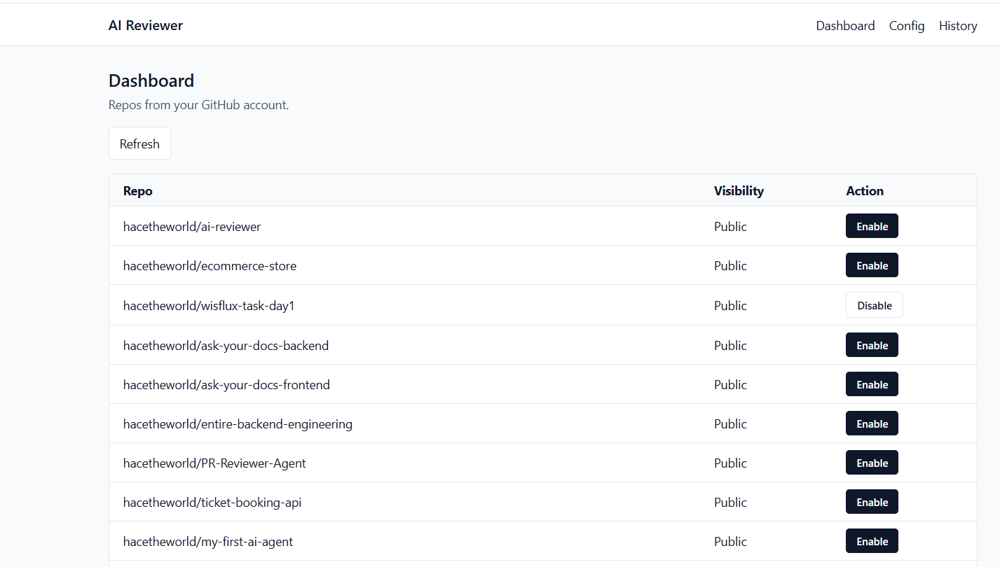
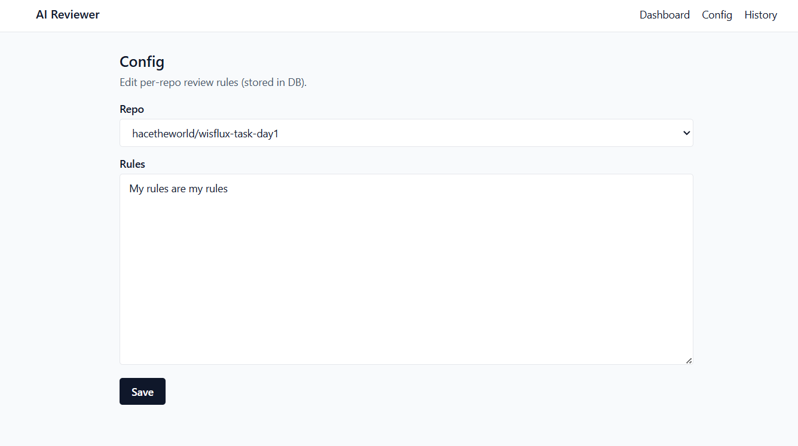
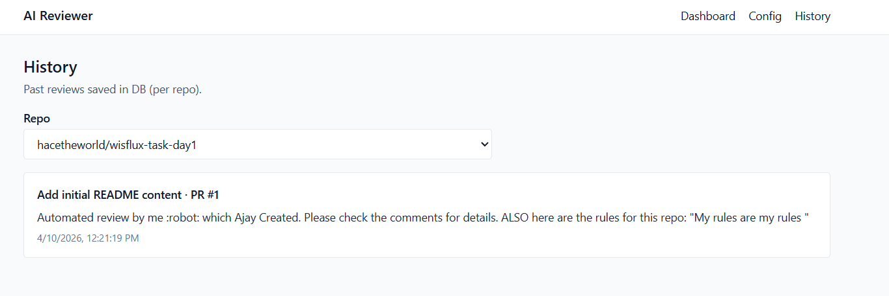
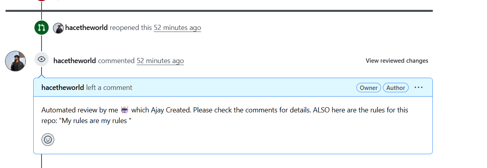

# ai-reviewer

Enable the AI agent on any repo and set the rules that the agent should check.

## Screenshots

| Login / Dashboard | Config | History |
| --- | --- | --- |
|  |  |  |

**PR Review Example**

## How it works (request flow)

1. User saves GitHub PAT in UI → backend stores it encrypted in `user_pat`.
2. UI lists GitHub repos via backend `GET /repos`.
3. User enables a repo → backend:
	- creates a GitHub webhook pointing to `WEBHOOK_URL`
	- stores the repo in `repos` and ties it to the PAT owner (`repos.github_user_id`)
4. GitHub sends pull_request webhooks → backend validates signature and enqueues a BullMQ job.
5. Worker consumes the job → fetches PR + diff from GitHub → loads repo rules from `config` → calls AI(currently i have disabled it for testing ) → posts PR review → saves `history`.

## Setup

### 1) Supabase schema

Run these SQL migrations in Supabase Dashboard → **SQL Editor** (in order):

- [supabase/migrations/0001_init.sql](supabase/migrations/0001_init.sql)
- [supabase/migrations/0002_repos_add_github_user_id.sql](supabase/migrations/0002_repos_add_github_user_id.sql)
- [supabase/migrations/0003_history_add_pr_title.sql](supabase/migrations/0003_history_add_pr_title.sql)
- [supabase/migrations/0004_config_add_github_user_id.sql](supabase/migrations/0004_config_add_github_user_id.sql)
- [supabase/migrations/0005_history_add_github_user_id.sql](supabase/migrations/0005_history_add_github_user_id.sql)

### 2) Environment variables (backend)

Create `app/backend/.env` (copy from `app/backend/.env.example`) and set at least:

- `SUPABASE_URL`
- `SUPABASE_SERVICE_ROLE_KEY`
- `ENCRYPTION_KEY`
- `WEBHOOK_SECRET`
- `WEBHOOK_URL` (public URL GitHub can reach, e.g. via ngrok)
- `GEMINI_API_KEY`
- `GEMINI_MODEL` (default in .env.example)

Redis (defaults are fine with docker-compose):
- `REDIS_HOST`
- `REDIS_PORT`

### 3) Run with Docker

- Start everything: `docker compose up --build`
- UI: http://localhost:3000
- Backend: http://localhost:3001/health

## Notes

- `WEBHOOK_URL` must be publicly reachable; Docker-internal URLs will not work with GitHub.
